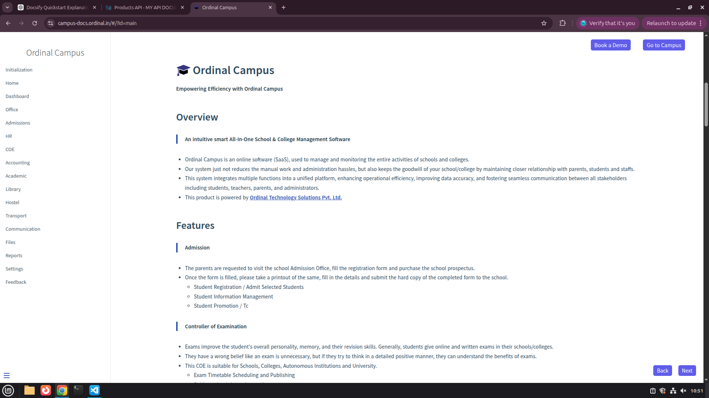

# Login API

Login an existing user.

## Login Screenshot



## Endpoint

```http
POST /api/auth/login
```

## Request Body

```json
{
  "email": "user@example.com",
  "password": "123456"
}
```

## Success Response

```json
{
  "success": true,
  "message": "Login successful",
  "token": "JWT_TOKEN"
}
```